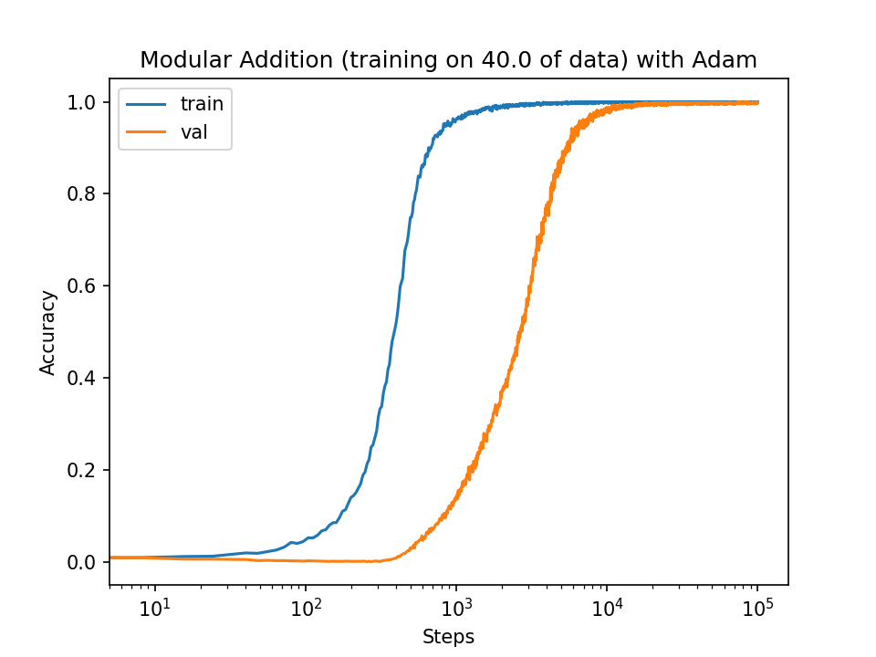
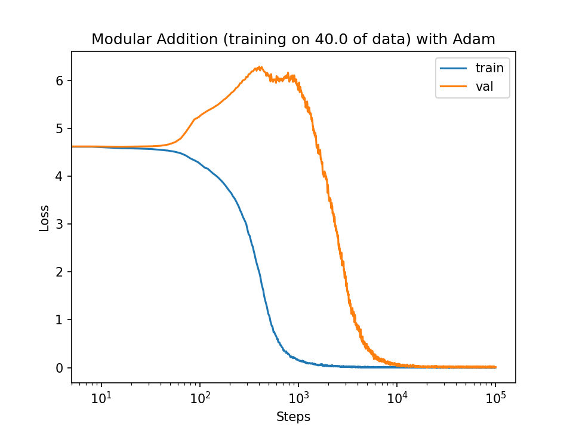
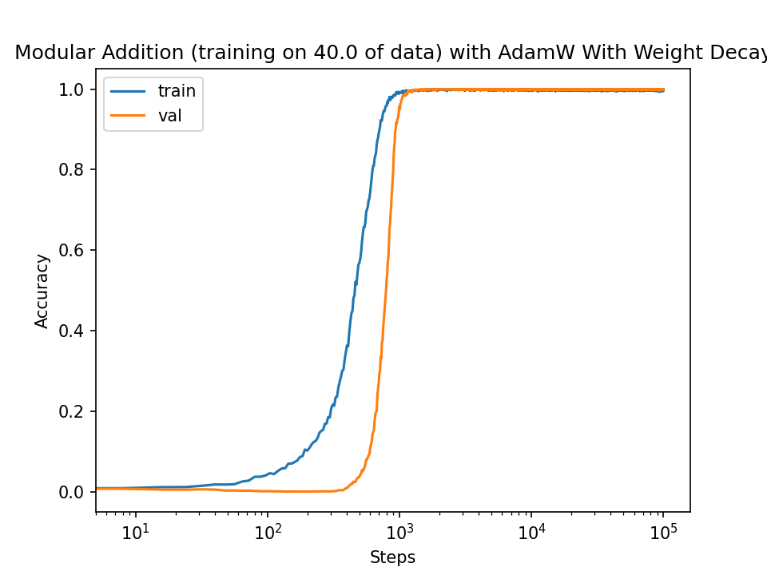
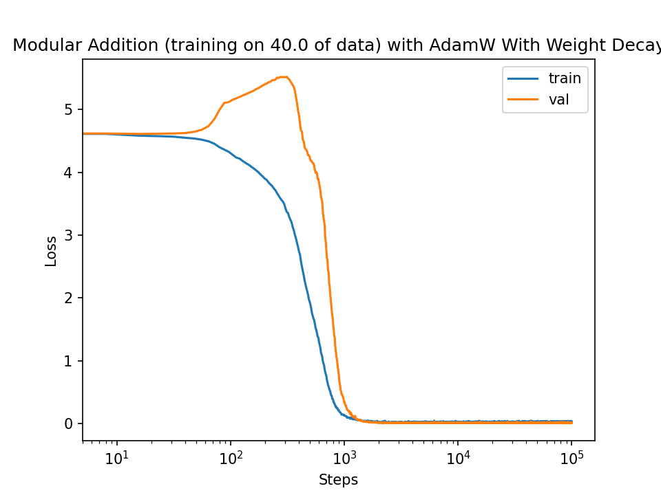

### Pytorch (RE)-Implementation of Grokking Phenomenon

This is a pytorch re-implementation of [Grokking: Generalization Beyond Overfitting on Small Algorithmic Datasets](https://arxiv.org/abs/2201.02177).

I thought this would be a good paper to reproduce since this would allow me to code and train a GPT style model from scratch.

References used for the Code :-

1. [MinGPT by Karpathy](https://github.com/karpathy/minGPT)

#### Accuracy Loss Curves for Adam (with any weight decay)

  
  

#### Accuracy Loss Curves for AdamW ( &lambda; = 1 )

  
  

